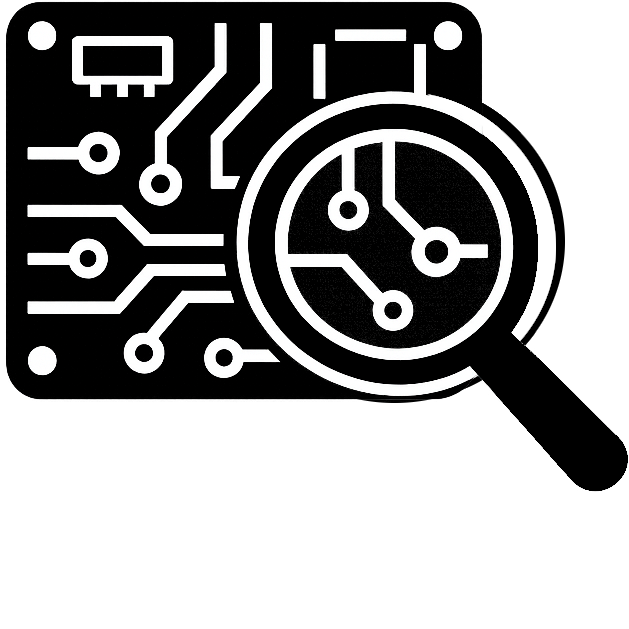
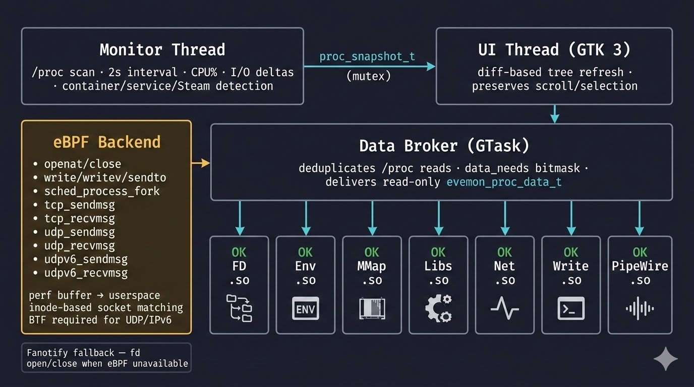

<p align="center">
    <picture>
        <source srcset="icon.png" media="(max-width: 400px)" />
        
    </picture>
</p>

# evemon
A graphical Linux process monitor focused on deep per-process introspection — built with C11, GTK 3, and eBPF.

> *"What is this process doing and why?"*

evemon drills into individual processes: their file descriptors, network sockets, environment, memory maps, shared libraries, cgroup limits, container context, Steam/Proton metadata, and even live PipeWire audio streams — all in one place.

---

## Features

### Process Tree
- Full parent/child hierarchy with expand/collapse
- Per-process and group-aggregate CPU%, RSS, and disk I/O columns
- Animated I/O sparklines per row (20-sample sliding window)
- Green fade-in for new processes, red fade-out for dying ones
- Pin any process to the top of the tree for persistent tracking
- Sort by any column (▲ = largest first for natural CPU/RSS ordering)
- Name filter (`Ctrl+F`) and Go-to-PID (`Ctrl+G`)

### Container & Service Detection
- **Containers** — Docker, Podman, LXC, Kubernetes, containerd, nspawn, Garden, Buildkit (cgroup path keywords + PID namespace inode heuristics)
- **Services** — systemd units (cgroup v1 + v2 path parsing) and OpenRC services (via `/run/openrc/daemons/` pidfile map)

### Steam / Proton
Detects Steam game launch trees via a multi-pass (up to 4 passes) parent-environment inheritance walk and resolves App ID, game name (from `appmanifest_<appid>.acf`), Proton version, Proton dist directory, runtime layer (sniper, soldier, …), compat data path, and game directory. Also detects standalone Wine/Lutris/Bottles processes via fast comm/cmdline heuristics before falling back to environment reads.

### Plugin-Based Sidebar
Each inspector is a standalone `.so` plugin loaded at runtime via `dlopen`. A central **data broker** gathers `/proc` data once per tracked PID and distributes it to all active plugin instances — no duplicate syscalls. Plugins declare a `data_needs` bitmask; the broker computes the OR of all active instances' needs each cycle and skips gathering data no plugin currently wants.

Built-in process plugins:

| Plugin | What it shows |
|--------|---------------|
| **File Descriptors** | Every open fd categorised into files, devices, sockets (TCP/UDP with addr:port), Unix sockets, pipes, eventfd/epoll/signalfd/timerfd/inotify. Device fds get human-readable sysfs labels (GPU, sound card, input device, …). Descendant-tree merging and duplicate grouping. |
| **Devices** | Device files (`/dev/*`) open by the process, resolved to hardware names (GPU/DRI, Sound/Audio, Input, Block Storage, Terminals/PTYs, Other). Optionally includes descendants; optionally merges duplicates. |
| **Write Monitor** | Live capture of stdout/stderr from the selected process and its entire descendant tree, including processes that live for less than a millisecond. Powered by eBPF syscall tracepoints (`write`, `writev`, `pwrite64`, `sendto`, `sendmsg`, `sendmmsg`, `splice`, `sendfile`) and an in-kernel fork propagation program — no userspace polling race. |
| **Network Sockets** | Per-connection throughput (send/recv bytes/s) for TCP and UDP (including IPv6/QUIC). Powered by eBPF kprobes on `tcp_sendmsg`/`tcp_recvmsg`, `udp_sendmsg`/`udp_recvmsg`, and `udpv6_sendmsg`/`udpv6_recvmsg`. Sockets matched to `/proc` fd entries by inode number — protocol-agnostic and correct for IPv6, UDP, and QUIC/WebRTC streams. TCP throughput additionally cross-checked via INET_DIAG netlink when running as root. |
| **Environment** | All variables from `/proc/<pid>/environ` classified into Paths, Display/Session, Locale, XDG, Steam/Proton, and Other. |
| **Memory Maps** | All regions from `/proc/<pid>/maps` — Code (r-x), Data (rw-), Heap, Stack, vDSO, Anonymous, and more. |
| **Shared Libraries** | Executable mappings categorised into Runtime, System, Application, Wine Built-in, and Windows DLL groups. Full Wine/Proton prefix awareness. |
| **Threads** | Per-thread TID, name, state, CPU time, priority, nice, last CPU core, and voluntary/involuntary context switch counts from `/proc/<pid>/task/`. |
| **cgroup Limits** | `memory.max`, `memory.current`, `memory.high`, `swap.max`, `cpu.max`, `pids.max`, `io.max`, etc. with percentage bars. Hidden when no explicit limits are set. |
| **PipeWire Audio** | Audio graph connections for the selected process with real-time L/R peak meters and an interactive FFT spectrogram. |
| **MilkDrop** | GPU-accelerated MilkDrop visualiser driven by the selected process's audio output via PipeWire. Renders in a dockable GTK surface using OpenGL (via libepoxy/GtkGLArea). |

Built-in headless service plugins:

| Plugin | Role |
|--------|------|
| **Audio Service** | Headless MPRIS2 + album-art provider. Resolves D-Bus media player metadata (track, artist, album, art URL, playback state) and publishes `EVEMON_EVENT_ALBUM_ART_UPDATED` events on the bus for UI plugins to consume. |
| **Write Monitor (service)** | Headless backend that subscribes to `EVEMON_EVENT_PROCESS_SELECTED` and registers `(pid, fd 1/2)` pairs in the eBPF `monitored_pids` map. Write events are published as `EVEMON_EVENT_FD_WRITE` for the UI half of the plugin. |

Built-in system panel plugins (always-active, process-independent):

| Plugin | What it shows |
|--------|---------------|
| **Files** (`system_fd`) | File descriptors of PID 1 (init/systemd) and its entire descendant tree — same fd categories as the per-process plugin. |
| **Libraries** (`system_libs`) | All shared libraries loaded across PID 1 and its descendants in a flat two-column list; selecting a row shows every process that has the library mapped. |

Plugins can be pinned to a specific PID, docked to any edge of the main tree, or floated as independent windows. Third-party plugins compile against a single public header ([`evemon_plugin.h`](src/evemon_plugin.h)). Plugins embed a flat ELF manifest (`.evemon_manifest` section) so the host can read name, version, role, and dependencies without executing any plugin code.

Plugin roles:
- **`EVEMON_ROLE_PROCESS`** — per-process tab in the sidebar.
- **`EVEMON_ROLE_SERVICE`** — headless, auto-activated at load; communicates via the event bus.
- **`EVEMON_ROLE_SYSTEM`** — always-active system panel tab, independent of the selected process.

### eBPF & Fanotify
- **eBPF backend** — attaches to syscall tracepoints for fd lifecycle (`sys_enter_openat`, `sys_exit_openat`, `sys_enter_close`), all write-family syscalls (`write`, `writev`, `pwrite64`, `sendto`, `sendmsg`, `sendmmsg`, `splice`, `sendfile`), and process lifecycle (`sched_process_fork`, `sched_process_exec`, `sched_process_exit`). Network throughput via kprobes on `tcp_sendmsg`/`tcp_recvmsg` (TCP), `udp_sendmsg`/`udp_recvmsg` (UDP/IPv4), and `udpv6_sendmsg`/`udpv6_recvmsg` (UDP/IPv6 — including QUIC and WebRTC). All net probes emit the socket inode number for protocol-agnostic matching. Events delivered via perf buffer with per-CPU scratch maps (`write_event_scratch`) to work around the 512-byte BPF stack limit. The `monitored_pids` map is sized dynamically from `/proc/sys/kernel/pid_max`. Requires `CONFIG_DEBUG_INFO_BTF=y` for correct struct offset resolution in the kprobes.
- **Fanotify fallback** — used for fd monitoring when eBPF isn't available (e.g. no `CAP_BPF`).
- **Orphan-stdout capture** — automatically intercepts stdout/stderr from any newly exec'd process whose output is not a TTY (cron jobs, systemd services, pipe sinks), triggered by the `sched_process_exec` tracepoint.

### UI Polish
- GTK theme switcher (View → Theme)
- Font size control (`Ctrl+Plus` / `Ctrl+Minus` / `Ctrl+0`)
- Middle-click autoscroll with logarithmic velocity
- Drag-to-resize and double-click-to-collapse sidebar sections
- Neofetch-style About dialog with animated distro logo, system info, and HDR status
- Desktop-aware modifier detection (KDE Meta-as-primary)
- Settings persisted to `~/.config/evemon/settings.json` (column order, theme, font size, plugin enable/disable, spectro theme, panel positions)

---

## Screenshot

*(coming soon)*

---

## Building

### Dependencies

| Library | Debian / Ubuntu | Arch | Purpose |
|---------|----------------|------|---------|
| GTK 3 | `libgtk-3-dev` | `gtk3` | GUI |
| GLib 2 / GIO | `libglib2.0-dev` | `glib2` | GDBus (MPRIS), event loop |
| fontconfig | `libfontconfig1-dev` | `fontconfig` | Font loading |
| libbpf | `libbpf-dev` | `libbpf` | eBPF fd/network monitor |
| libelf | `libelf-dev` | `libelf` | eBPF ELF loading |
| zlib | `zlib1g-dev` | `zlib` | eBPF compression |
| jansson | `libjansson-dev` | `jansson` | JSON settings file |
| clang | `clang` | `clang` | BPF kernel program compilation |
| glib-compile-resources | `libglib2.0-dev-bin` | `glib2` | Embedded resources (icon, font) |
| libepoxy | `libepoxy-dev` | `libepoxy` | OpenGL (MilkDrop plugin) |
| GtkSourceView 4 *(optional)* | `libgtksourceview-4-dev` | `gtksourceview4` | Syntax-highlighted write-monitor output |
| libsoup 3 *(optional)* | `libsoup-3.0-dev` | `libsoup3` | Album art HTTP download |
| PipeWire *(optional)* | `libpipewire-0.3-dev` | `pipewire` | Audio graph + spectrogram |

### Compile

```sh
make
```

PipeWire support is auto-detected. To explicitly disable it:

```sh
make HAVE_PIPEWIRE=0
```

Additional `make` targets:

| Target | Purpose |
|--------|---------|
| `make debug` | Build with `-Og -g3`, no fortify |
| `make gdb` | Debug build + launch under gdb |
| `make asan` | AddressSanitizer build |
| `make ubsan` | UBSan + ASan build |
| `make deb target=debian12` | Build `.deb` via Docker |
| `make rpm target=fedora42` | Build `.rpm` via Docker |
| `make install` | Install to `$(PREFIX)` (default `/usr/local`) |

Build outputs:

```
build/evemon                  # main binary
build/fdmon_ebpf_kern.o       # eBPF kernel program (loaded at runtime)
build/plugins/evemon_*.so     # sidebar plugins
```

### Run

```sh
sudo ./build/evemon
```

Root (or `CAP_BPF` + `CAP_PERFMON`) is required for eBPF tracing and full `/proc` visibility across users. evemon degrades gracefully without privileges — you'll see your own processes and can use the fanotify fallback for fd tracking.

### Command-Line Options

| Flag | Description |
|------|-------------|
| `-d` / `--debug` | Enable verbose debug logging |
| `-a` / `--debug-audio` | Enable audio/PipeWire debug logging |
| `-p <PID>` / `--pid <PID>` | Pre-select a process by PID on startup |
| `-s` / `--safe-mode` | Start without loading any plugins |
| `-h` / `--help` | Show help |

---

## Tree Columns

| Column | Description |
|--------|-------------|
| PID | Process ID |
| PPID | Parent process ID |
| User | Owning user (resolved via `getpwuid_r`) |
| Name | Process name (`/proc/<pid>/comm`); Steam processes show a rich label, e.g. `reaper (Steam) · Deadlock [Proton ...]` |
| CPU% | Per-process CPU utilisation (delta ticks / elapsed × CLK_TCK × num_cpus) |
| RSS | Resident set size (VmRSS from `/proc/<pid>/status`) |
| Group RSS | Sum of self + all descendant RSS |
| Group CPU% | Sum of self + all descendant CPU% |
| I/O Read | Disk read rate (bytes/s) from `/proc/<pid>/io` `read_bytes` delta |
| I/O Write | Disk write rate (bytes/s) from `/proc/<pid>/io` `write_bytes` delta |
| I/O Sparkline | Animated 20-sample bar chart of combined I/O history |
| Start Time | Process start time (from `stat` field 22 + boot time from `/proc/stat`) |
| Container | Container runtime label (docker, lxc, podman, k8s, containerd, nspawn, garden, buildkit, container) |
| Service | systemd unit (`.service` / `.scope`) or OpenRC service name |
| CWD | Current working directory (`/proc/<pid>/cwd` readlink) |
| Command | Full command line (`/proc/<pid>/cmdline`, NUL → space, UTF-8 sanitised) |

---

## Keyboard Shortcuts

| Shortcut | Action |
|----------|--------|
| `Ctrl+F` / `Meta+F` | Toggle name filter |
| `Ctrl+G` / `Meta+G` | Go to PID |
| `Ctrl+=` / `Ctrl++` | Increase font size |
| `Ctrl+-` | Decrease font size |
| `Ctrl+0` | Reset font size |
| `Ctrl+Q` | Quit |
| `Alt` (tap) | Show menu bar |
| `Escape` | Close filter / return focus to tree |
| `←` / `→` | Collapse / expand selected row |
| Middle-click drag | Autoscroll |
| Double-click | Open sidebar for process |

### Context Menus

- **Right-click process** — Pin/Unpin, Copy Command, Send Signal (SIGTERM, SIGKILL, SIGSTOP, SIGCONT, …), Send Signal to Tree
- **Right-click status bar** — Toggle menu bar

---

## Architecture



- **Monitor thread** (`monitor.c`) — scans `/proc` every 2 seconds (`POLL_INTERVAL_MS = 2000`), builds a `proc_snapshot_t` backed by a flat variable-length string table (`proc_strtab_t`), computes CPU% and I/O rates via delta ticks with `CLOCK_MONOTONIC`, maintains a 20-sample I/O history ring per PID, runs up to 4 Steam enrichment passes, and publishes under a mutex. An early partial snapshot is published as soon as init (PID 1) and a pre-selected PID are both scanned, so the UI can show the target immediately without waiting for the full scan.
- **UI thread** (`ui_gtk.c`) — GTK 3 main loop. Diff-based tree updates (remove dead → update in-place → insert new) preserve scroll, selection, and expand state. A GLib timeout every ~1 s pulls the latest snapshot; process icon loading is done via `proc_icon.c`.
- **Data broker** (`plugin_broker.c`) — single pthread worker that gathers `/proc` data for all tracked PIDs, deduplicating reads across plugins via an OR'd `data_needs` bitmask. The effective needs mask is computed per-cycle by consulting each instance's `wants_update()` callback so hidden/paused plugins don't trigger unnecessary I/O. Plugins receive a read-only `evemon_proc_data_t` and render on the GTK main thread via a `g_idle_add` completion hook.
- **Plugin system** (`plugin_loader.c`, `evemon_plugin.h`) — plugins are `.so` files loaded with `dlopen`. Each exports `evemon_plugin_init()` and embeds a flat ELF manifest in the `.evemon_manifest` section readable without code execution. Three roles: `EVEMON_ROLE_PROCESS`, `EVEMON_ROLE_SERVICE`, `EVEMON_ROLE_SYSTEM`. Dependency ordering is respected at activation time. Plugins communicate via the event bus (`event_bus.c`) rather than calling each other directly.
- **eBPF backend** (`fdmon_ebpf_kern.c` + `fdmon_ebpf.c`) — `fdmon_ebpf_kern.c` compiled to BPF bytecode with clang. Tracepoints cover fd lifecycle, all write-family syscalls, and `sched_process_fork`/`sched_process_exec`/`sched_process_exit`. The fork program propagates the `monitored_pids` map entry from parent to child in kernel space — enabling zero-latency capture of sub-millisecond worker processes. Network throughput kprobes cover TCP and UDP (IPv4 + IPv6) with inode-based socket matching via a fixed-offset chain through `struct sock → sk_socket → file → f_inode → i_ino`. Events delivered via perf buffer; write events use a per-CPU `PERCPU_ARRAY` scratch map to carry up to 4096-byte payloads past the 512-byte BPF stack limit.
- **Fanotify backend** (`fdmon.c`) — fallback for fd monitoring when eBPF is unavailable. Uses `fanotify_init`/`fanotify_mark` on the root mount; cannot track sockets, pipes, or anonymous fds.
- **MPRIS** (`mpris.c`) — scans D-Bus session bus for `org.mpris.MediaPlayer2` instances, resolves PIDs, and returns playback metadata. Runs on the broker worker thread; creates its own synchronous `GDBusConnection`. Falls back to `/run/user/<uid>/bus` when running as root.

---

## Status Bar

| Left | Right |
|------|-------|
| Process count · CPU count · memory used/total · UI render time (last/avg/max) | Uptime · logged-in users · 1/5/15 min load averages |

---

## Writing Plugins

Plugins are shared objects that export a single entry point:

```c
evemon_plugin_t *evemon_plugin_init(void);
```

The returned descriptor declares what data the plugin needs (`evemon_NEED_FDS`, `evemon_NEED_ENV`, etc.) and provides callbacks: `create_widget`, `update`, `clear`, `destroy`, `activate` (for host services injection), and optional `wants_update`, `is_available`, and `set_active` hooks. The host handles all `/proc` I/O, threading, and layout — plugins just render.

Use the `EVEMON_PLUGIN_MANIFEST` macro to embed a relocation-free flat manifest:

```c
EVEMON_PLUGIN_MANIFEST(
    "org.evemon.myplugin",  /* id */
    "My Plugin",            /* name */
    "1.0",                  /* version */
    EVEMON_ROLE_PROCESS,    /* role */
    NULL                    /* dependencies (NULL-terminated list) */
);
```

See [`src/evemon_plugin.h`](src/evemon_plugin.h) for the full ABI.

Compile and drop into `build/plugins/`:

```sh
gcc -shared -fPIC -o evemon_myplugin.so myplugin.c $(pkg-config --cflags --libs gtk+-3.0)
```

---

## Credits

- **[font-logos](https://github.com/lukas-w/font-logos)** (v1.3.0) by Lukas W. — Linux distribution logo icon font used in the About dialog. Licensed under the [Unlicense](https://github.com/lukas-w/font-logos/blob/master/LICENSE).

---

## License

*(to be decided)*
